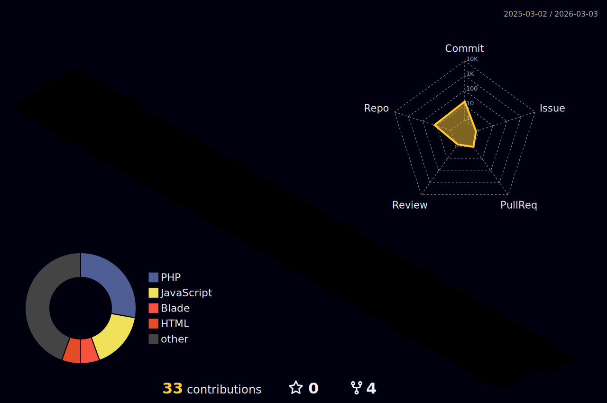

  
# 👋 Hi there, I'm Nguyen Dinh Tuan Khoa

 

---

## 🌐 Connect with Me

---

## 🏆 GitHub Trophies

---

## 📊 GitHub Stats

  
  

---

## 🔥 GitHub Streak Stats

  

---

## � Contribution Graph

  

---

## �🐍 GitHub Contribution Snake

<picture>
  <source media="(prefers-color-scheme: dark)" srcset="https://raw.githubusercontent.com/NguyenDinhTuanKhoa/NguyenDinhTuanKhoa/output/github-snake-dark.svg">
  <source media="(prefers-color-scheme: light)" srcset="https://raw.githubusercontent.com/NguyenDinhTuanKhoa/NguyenDinhTuanKhoa/output/github-snake.svg">
  
</picture>

---

## 📊 3D Contribution Graph

---

## 💻 Tech Stack

---

### 💫 "Code is like humor. When you have to explain it, it's bad." – Cory House

